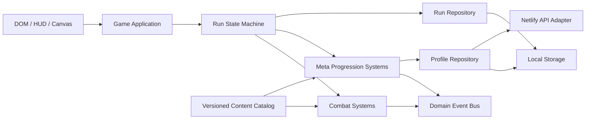

# Dark Defense — audit arhitectural și roadmap RPG

## 1. Rezumat executiv

Proiectul este un joc web Canvas/JavaScript cu backend Netlify Functions și Neon. Nucleul Tower Defense este deja mai bogat decât pare la prima vedere: are șase hărți, cinci tipuri de turnuri, specializări, vrăji, boss fights, Endless, Daily Challenge, auras, progresie Ascension, conturi și leaderboards.

Direcția recomandată nu este o rescriere. Este o extracție incrementală din monolit, prin vertical slices care livrează gameplay și mută simultan responsabilități în module independente.

Primul vertical slice este implementat în această versiune:

- profil RPG versionat, cu import sigur al progresului legacy;
- Event Bus pentru comunicare slab cuplată;
- Hero System MVP: Varyn, progresie persistentă, XP/nivel, atac automat, blocarea unui inamic, repoziționare, abilitate activă, moarte/respawn și Save/Resume;
- nouă teste automate pentru profil și erou;
- compatibilitate cu salvările de run v2.

## 2. Inventarul sistemelor existente

| Zonă | Stare curentă | Observație |
|---|---|---|
| Tower Defense core | solid | plasare, upgrade, sell, target priority, projectiles, status effects |
| Tower Evolution | parțial | fiecare turn are două specializări la nivelul 2 |
| Skill Trees | implementat MVP | Ascension/Ley pentru cont și arbore separat cu 3 ramuri pentru Varyn |
| Procedural Rewards | implementat MVP | loot determinist, affixe, Loot Cache și pity Rare/Epic |
| Boss Phases | implementat MVP | catalog data-driven cu trei faze pentru fiecare boss de campanie |
| Story Campaign | minim | șase stage-uri liniare și texte cinematice |
| Hero System | implementat MVP | Varyn, nivel 1–20 și gameplay tactic |
| Inventory / Equipment | implementat MVP | inventory persistent, cinci sloturi și stat pipeline comun |
| Castle / World Map | neimplementat | schema profilului este pregătită |
| Random Events | neimplementat | Daily Challenge este un sistem separat, nu event engine |
| Prestige | neimplementat | schema profilului este pregătită |
| Guild | neimplementat | schema este local-first și single-player ready |
| Backend | funcțional | auth, profile, Ley sync, run tokens, leaderboards |

## 3. Problemele arhitecturale principale

### P0 — secret implicit în backend

`start-run.js` și `submit-score.js` cad pe valoarea publică `dark-defense-dev-secret` dacă variabilele de mediu lipsesc. În producție, funcțiile trebuie să eșueze controlat dacă `RUN_TOKEN_SECRET` nu este configurat. Altfel, tokenurile pot fi reproduse.

### P1 — `game.js` este un God Object

Fișierul are aproximativ 8.200 de linii, peste 300 de funcții top-level și combină:

- catalog de conținut;
- state management;
- economie;
- AI și combat;
- input;
- Canvas rendering;
- DOM/HUD;
- audio;
- persistence;
- requesturi de rețea;
- flow-ul campaniei.

Orice feature nou atinge mai multe zone și crește riscul de regresie. Hero System folosește un adapter mic în monolit și ține restul logicii în propriul modul; acesta este modelul recomandat pentru toate sistemele noi.

### P1 — persistență fragmentată

Există peste 40 de accesări directe `localStorage`, cu chei și formate diferite. Progresul, setările, talent tree, achievements și run resume nu împart un contract sau migrații comune. O schimbare de format poate pierde date.

Noul `ProfileStore` introduce:

- `schemaVersion`;
- validare și normalizare;
- copie defensivă;
- import al cheilor legacy;
- backup pentru JSON corupt;
- containere explicite pentru viitoarele sisteme RPG.

Cheile vechi rămân active momentan, pentru compatibilitate. Migrarea lor trebuie făcută gradual, sistem cu sistem.

### P1 — flow implicit, fără state machine

Combinații precum `currentMode`, `dailyChallengeActive`, `waveActive`, `isPaused`, `pendingAuraChoice` și `pendingBossResolution` pot forma stări imposibile. Un `RunStateMachine` explicit trebuie să definească tranzițiile:

`MENU → BUILD → WAVE → BOSS_REWARD → STAGE_COMPLETE → BUILD`

și ramurile `PAUSED`, `GAME_OVER`, `CAMPAIGN_COMPLETE`.

### P1 — random fără run seed comun

O mare parte din joc folosește `Math.random()`. Daily Challenge are logică seeded separată, dar aura drafts, boss pairs și viitoarele item drops nu pot fi reproduse. Procedural Rewards are nevoie de `RunRng`, cu seed salvat în `RunState`.

### P2 — content și comportament sunt amestecate

Turnurile, specializările, stage-urile, boss metadata și efectele lor sunt declarate în același fișier care rulează simularea. Definițiile trebuie mutate în cataloage JSON/JS imutabile, identificate prin ID.

Salvările trebuie să păstreze doar:

- `definitionId`;
- nivel;
- affixes/rolls;
- stare de instanță.

Nu trebuie salvată o copie completă a definiției de conținut.

### P2 — CSS append-only

`style.css` are peste 5.400 de linii, multe reguli duplicate și override-uri succesive. Recomandarea este separarea în tokens, layout, components și responsive, fără schimbarea vizuală într-un singur pas.

### P2 — lipsa unei piramide de testare

Înainte de această versiune nu exista un test runner. Testele noi acoperă doar Profile/Hero. Următoarele extrageri trebuie să adauge teste pure pentru economie, RNG, rewards, item generation și state transitions, plus un smoke test de browser.

### P2 — backend repetitiv și fără contract client comun

Cele 17 Netlify Functions repetă validări, serializare și error handling. Clientul face `fetch` direct din gameplay. Este necesar un `ApiClient`, iar backend-ul are nevoie de helpers comuni pentru responses, auth, rate limits și validarea payloadurilor.

## 4. Arhitectura țintă

Separarea importantă este între patru tipuri de stare:

| Tip | Durată | Exemple |
|---|---|---|
| Content Catalog | versiune de joc | definiții heroes, items, towers, bosses, stages |
| Player Profile | între sesiuni | nivel erou, inventory, equipment, castle, story, prestige |
| Run State | durata unui run | seed, stage, gold, lives, towers, cooldowns, hero HP |
| Combat State | un frame/wave | enemies, projectiles, particles, telegraphs |



Structura recomandată, construită incremental:

```text
js/
  app/
    bootstrap.js
    game-application.js
    run-state-machine.js
  core/
    event-bus.js
    clock.js
    run-rng.js
    ids.js
  content/
    heroes.js
    items.js
    towers.js
    bosses.js
    stages.js
  domain/
    player-profile.js
    run-state.js
    item-instance.js
  systems/
    hero-system.js
    inventory-system.js
    equipment-system.js
    reward-system.js
    skill-tree-system.js
    castle-system.js
    story-system.js
    event-system.js
    prestige-system.js
    guild-system.js
  adapters/
    profile-store.js
    run-store.js
    api-client.js
  presentation/
    canvas-renderer.js
    hud-controller.js
    screens/
```

### Reguli de dependență

1. `content` și `domain` nu cunosc DOM, Canvas, `fetch` sau `localStorage`.
2. Un `system` primește dependențele prin constructor/factory; nu citește globals.
3. UI trimite commands și ascultă events; nu modifică direct state intern.
4. Persistence stochează ID-uri și date de instanță, nu funcții sau definiții.
5. Orice date ale jucătorului au `schemaVersion` și migrații.
6. Orice run procedural are seed, iar seed-ul intră în Save/Resume și score submission.
7. Backend-ul validează toate recompensele cu impact online; clientul nu este autoritate.

## 5. Roadmap recomandat

### v0.8 — RPG Foundation & First Hero

Status: fundația v0.8 este implementată.

- ProfileStore versionat și import legacy;
- Event Bus;
- Hero System MVP;
- save v5, compatibil cu run save v2, v3 și v4;
- teste unitare și browser smoke test;
- `RunRng`, `RunStateMachine` și `ApiClient` extrase din monolit;
- gate de release: zero erori în consola browserului, profile corruption recovery, save/resume stabil.

### v0.8.1 — Combat Architecture

Status: implementat și integrat.

- `RunRng` determinist, cu seed, state și număr de draws persistate;
- Daily Challenge folosește un seed stabil pe zi, iar run-urile normale primesc seed unic;
- selecția inamicilor, aura drafts, proc-urile de combat și perechile Endless folosesc același RNG;
- `EnemyBehaviorSystem` separat de loop-ul principal;
- Pack Hunter: inamicii fast accelerează în grup;
- Bulwark: inamicii armored protejează aliații apropiați;
- Last Stand: tank-urile sub 40% HP accelerează și rezistă mai bine la slow;
- targeting-ul turnurilor prioritizează amenințările active;
- `BossPhaseSystem` declarativ, cu două tranziții și trei faze pentru fiecare boss;
- telegraph de 1,2 secunde înaintea fiecărei tranziții;
- summon, rage, shield și roots scalează cu intensitatea fazei;
- shield-ul de boss absoarbe damage real și este afișat în HUD;
- damage-ul produs de turnuri, erou, spells, burn, splash și chain trece printr-un singur adapter;
- gate validat: 17/17 teste, save v3 reluat în browser, Pack Hunter observat live, zero warnings/errors, layout 390×844 fără overflow orizontal.

### v0.8.2 — Application Architecture

Status: implementat și integrat.

- `RunStateMachine` definește explicit fazele `idle`, `ready`, `wave`, `paused`, `reward`, `transition` și `game_over`;
- tranzițiile invalide sunt respinse fără să modifice starea;
- pause/resume păstrează faza anterioară, inclusiv în timpul luptei;
- boss rewards și schimbările de stage au faze distincte;
- start, restart, reset, Daily Challenge, Endless și Resume sincronizează aceeași stare;
- run save v5 persistă snapshot-ul fluxului;
- salvările v2–v4 sunt încărcate în faza sigură `ready`;
- `ApiClient` centralizează toate Netlify Functions folosite de `game.js`;
- request-urile JSON, query parameters, credentials, timeout-urile și `sendBeacon` au un contract unic;
- erorile HTTP și network sunt expuse ca `ApiError`, cu `status`, `code`, `details` și `retryable`;
- `game.js` nu mai apelează direct `fetch`;
- gate validat: 27/27 teste, save v4 reluat, save v5 creat și reluat, start/wave/pause/resume/reset verificate în browser, zero warnings/errors.

### v0.9 — Loot & Buildcraft

Status: v0.9.2 livrează fluxul complet Boss → Loot Cache → Inventory → Equipment/Skills → Hero Stats. Tower Evolution rămâne ultima componentă majoră din v0.9.

- `reward-content.js` definește rarități, iteme, affixe și reward tables fără dependențe de UI;
- `RewardGenerator` folosește `RunRng`, stage-ul, modul și un `sourceId` stabil;
- aceeași sursă produce aceleași bundle/item IDs și nu poate acorda recompensa de două ori;
- `RewardInbox` păstrează itemele neclaimuite în profilul persistent, fără item loss;
- pity Rare/Epic este configurat separat pentru Campaign, Endless și Daily;
- counterele pity avansează atomic numai când un bundle unic este acceptat în Loot Cache;
- Profile schema v4 migrează, sanitizează și persistă imediat `inventory`, `rewards`, loadout-urile și rank-urile de skill;
- recompensa de boss afișează raritatea, nivelul, slotul, affix-ul și Power;
- `InventorySystem` mută bundle-uri atomic și lasă Loot Cache intact dacă inventarul este plin sau apare un conflict;
- `EquipmentSystem` validează sloturile, suportă swap/unequip și nu șterge itemele înlocuite;
- `HeroStatPipeline` compune level, equipment și skill modifiers și aplică limite pentru cooldown, attack speed și respawn;
- echipamentul și skill-urile modifică damage, HP, attack speed, movement, ability damage/cooldown, boss damage și respawn;
- UI responsive oferă Claim All, claim individual, sort/filter, cinci sloturi și preview live;
- `HeroSkillTreeSystem` acordă un punct per nivel după Level 1 și validează rank caps și prerequisites;
- nouă skill-uri data-driven formează trei ramuri: Warden's Blade, Riftcaller și Last Bastion;
- purchase și Respec sunt persistente, iar stats sunt recalculate imediat fără pierderea XP-ului sau a echipamentului;
- UI responsive oferă badge de puncte, shortcut `K`, feedback de unlock și confirmare în doi pași pentru Respec;
- următorul vertical slice extrage Tower Evolution într-un catalog și sistem reutilizabil.

- `ItemDefinition` + `ItemInstance`: implementat;
- Inventory cu capacity, sort/filter și overflow Loot Cache: implementat;
- Equipment slots pentru erou: implementat;
- affixes și rarități data-driven: implementat;
- Procedural Reward Service cu run seed și pity counters: implementat;
- ecran de rewards după boss/stage: implementat;
- Hero Skill Tree separat de Ascension: implementat MVP;
- Tower Evolution extras din specializările hardcodate într-un catalog: planificat;
- gate curent: 54/54 teste, buildcraft persistent și layout desktop/mobile validate.

Ordinea internă:

1. Reward tables;
2. Inventory;
3. Equipment/stat pipeline;
4. UI;
5. Skill Tree;
6. Tower Evolution.

### v1.0 — Premium Campaign

- World Map cu noduri, prerequisites și dificultăți;
- Story Campaign cu chapters, quests, dialog flags și rewards;
- Castle Upgrades care deblochează funcții, nu doar procente;
- extinderea Boss Phase State Machine cu ability decks și variante de dificultate;
- Random Events între lupte, cu choices și consequences;
- trei eroi cu roluri distincte și loadouts;
- tutorial și onboarding pentru sistemele meta;
- save cloud pentru întregul Player Profile;
- gate de release: campanie completă, balans PC/mobile, recovery offline/cloud.

### v1.1 — Endgame & Prestige

- Prestige cu reset explicit și preview complet al pierderilor/câștigurilor;
- difficulty tiers, mutators și seasonal rule sets locale;
- endgame item tiers și crafting/reroll controlat;
- boss phase variants;
- telemetry de balans fără date personale sensibile;
- gate de release: economia nu are bucle infinite, resetul este reversibil până la confirmare.

### v1.2 — Guild, single-player ready

- `GuildService` și `GuildRepository` ca interfețe de domeniu;
- local guild roster cu NPC members;
- guild hall upgrades, projects și expeditions asincrone locale;
- contribution ledger și guild quests;
- adapter remote opțional ulterior, fără schimbarea regulilor de gameplay;
- gate de release: toate funcțiile guild merg offline cu repository local.

## 6. Hero System implementat

Varyn este primul erou și validează arhitectura:

- nivel maxim 20;
- XP persistent în `darkDefense.profile`;
- atac ranged automat;
- poate bloca un inamic non-boss și primește damage;
- click pe card, apoi click pe drum pentru repoziționare;
- `Rift Pulse`, activat din HUD sau cu `C`;
- moare și revine după 12 secunde;
- HP, poziția și cooldownurile intră în run save;
- nivelul și XP rămân între run-uri;
- UI responsive pe desktop și mobile.

Punctele de integrare în monolit sunt intenționat puține:

- adapter de damage;
- update;
- draw;
- reward-on-kill;
- input;
- save/restore;
- reset de stage.

Inventory și Equipment vor modifica statisticile eroului printr-un viitor `StatPipeline`, fără să schimbe bucla de combat.

## 7. Contracte recomandate pentru următoarele sisteme

### Item

```js
{
  instanceId: "itm_...",
  definitionId: "warden_blade",
  level: 7,
  rarity: "rare",
  affixes: [
    { id: "hero_damage_pct", roll: 0.083 }
  ],
  boundHeroId: null
}
```

### Reward bundle

```js
{
  sourceId: "stage_2_boss",
  runSeed: "run_...",
  currency: { gold: 120, crystals: 8 },
  itemInstanceIds: ["itm_..."],
  choiceGroupId: null
}
```

### Boss phase

```js
{
  id: "phase_2",
  enterWhen: { hpBelow: 0.55 },
  enterActions: ["cast_shield", "summon_minions"],
  abilityDeck: ["void_wave", "tower_lock"],
  exitWhen: { hpBelow: 0.22 }
}
```

## 8. Riscuri și decizii de produs

- Progresia permanentă trebuie limitată astfel încât să ofere varietate, nu să elimine strategia TD.
- Equipment trebuie să modifice eroul și stilul de joc înainte să ofere bonusuri globale turnurilor.
- Castle upgrades trebuie să deblocheze opțiuni și ramuri, nu doar multiplicatori cumulativi.
- Prestige trebuie proiectat după ce economia v1.0 poate fi măsurată; implementarea prematură va masca problemele de balans.
- Guild trebuie să fie un domain model local-first. Networking-ul este un adapter viitor, nu centrul sistemului.
- Competitive leaderboards nu pot deveni complet sigure cu simulare client-side. Tokenurile și plausibility checks reduc abuzul, dar nu înlocuiesc o simulare autoritativă.

## 9. Verificare efectuată

- v0.9.2: `npm run check` și 54/54 teste trecute;
- v0.9.2 Skill Tree: două rank-uri Ashen Edge au modificat Damage 32,8 → 35,4;
- v0.9.2 persistence: rank-urile și stats au rămas active după reload;
- v0.9.2 Respec: confirmarea în doi pași a returnat 2 puncte și Damage la 32,8, fără pierdere de XP sau echipament;
- v0.9.2 pity: threshold-urile Rare/Epic, resetarea counterelor și deduplicarea atomică sunt acoperite de teste;
- v0.9.2 responsive: layout Skill Tree 390×844 scrollabil, fără overflow orizontal;
- v0.9.2 consola browserului: zero warnings/errors;
- v0.9.1: `npm run check` și 44/44 teste trecute;
- v0.9.1 claim: itemul a trecut atomic din Loot Cache în Inventory, iar contoarele s-au actualizat;
- v0.9.1 equipment: Damage 32,8 → 42,6 și Power 0 → 43 pentru Warden Blade-ul de test;
- v0.9.1 persistence: echiparea a rămas activă după reload; Unequip a readus statisticile și a păstrat itemul;
- v0.9.1 responsive: layout 390×844 scrollabil, fără overflow orizontal;
- v0.9.1 consola browserului: zero warnings/errors;
- v0.9.0: `npm run check` și 34/34 teste trecute;
- v0.9.0 browser: boss învins prin gameplay normal, item procedural afișat și Loot Cache incrementat;
- v0.9.0 persistence: reload-ul păstrează itemul și reluarea aceleiași surse nu îl poate duplica;
- v0.9.0 responsive: layout 390×844 fără overflow orizontal, iar reward overlay-ul lung poate fi derulat;
- v0.9.0 consola browserului: zero warnings/errors;
- `npm run check`: toate fișierele JavaScript modificate sunt valide sintactic;
- v0.8.2 `npm test`: 27/27 teste trecute;
- browser desktop: salvare v4 reluată, run nou, wave, pause, resume și reset verificate;
- reload în faza `ready`: save v5 creat și afișat corect în Resume;
- browser mobile 390×844: canvas și Resume overlay rămân în viewport, fără overflow orizontal;
- zero warnings/errors în consola browserului;
- salvările v2–v4 sunt acceptate; datele flow/RNG lipsă primesc valori compatibile.
